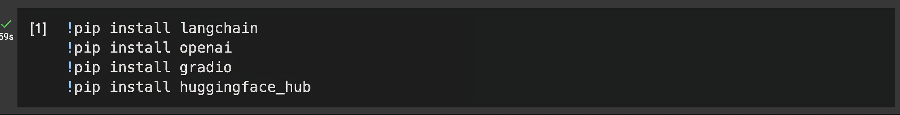
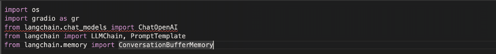
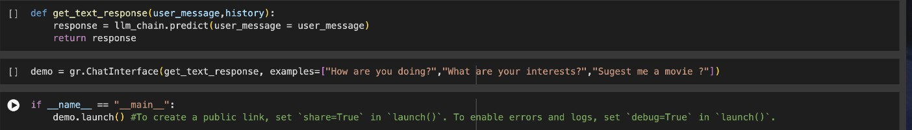
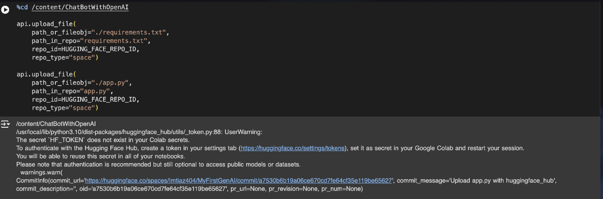
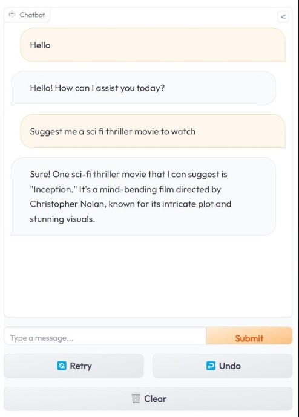

# Conversational AI System — LangChain · GPT-3.5-Turbo · Hugging Face Spaces

> Most "chatbot" tutorials stop at a single API call. This project starts where they end.
> A production-architected, memory-persistent conversational agent — built with deliberate engineering decisions across LLM orchestration, prompt design, and cloud deployment, then shipped to a live Hugging Face Space with programmatic CI/CD.

🚀 **[Live Demo → Hugging Face Spaces](https://huggingface.co/spaces/Imtiaz404/MyFirstGenAI)**

---

## The Real-World Problem This Solves

Consumer-facing AI assistants fail in one consistent way: they forget. Each turn is stateless. Users repeat themselves. Context collapses.

This project implements a **stateful conversational agent** — one that maintains full session context across turns via `ConversationBufferMemory`, uses a structured persona-injected prompt to shape model reasoning, and ships as a live web product with managed secrets and a programmatic deployment pipeline.

The system answers a question most tutorials skip: **how do you actually architect, reason about, and deploy a context-aware LLM application end-to-end?**

---

## What Makes This Different

| What most projects do | What this project does |
|---|---|
| Raw `openai.chat.completions.create()` call | LangChain `LLMChain` with enforced separation of prompt, memory, and model |
| Stateless — no memory between turns | `ConversationBufferMemory` injects full turn history into every prompt |
| Hardcoded API keys | Runtime secret injection via Hugging Face Spaces vault |
| Manual file upload to deploy | Programmatic `HfApi.upload_file()` — mirrors real CI/CD |
| Default prompts | Hand-crafted `PromptTemplate` with persona + dynamic variable injection |
| Notebook as final deliverable | Notebook as build env; `app.py` as the deployed production entry point |

---

## System Architecture

```
┌─────────────────────────────────────────────────────────────┐
│                     USER INTERFACE LAYER                     │
│              Gradio ChatInterface  (gr.ChatInterface)        │
└──────────────────────────┬──────────────────────────────────┘
                           │ user_message + history
                           ▼
┌─────────────────────────────────────────────────────────────┐
│                   ORCHESTRATION LAYER (LangChain)            │
│                                                              │
│   PromptTemplate ──► LLMChain ──► ChatOpenAI (GPT-3.5)      │
│         │                │                                   │
│   {chat_history}   ConversationBufferMemory                  │
│   {user_message}   (persists turn-by-turn context)           │
└──────────────────────────┬──────────────────────────────────┘
                           │ Formatted prompt + context window
                           ▼
┌─────────────────────────────────────────────────────────────┐
│                   LLM INFERENCE LAYER                        │
│              OpenAI GPT-3.5-Turbo (via API)                  │
│           temperature=0.5 | determinism-creativity tradeoff  │
└──────────────────────────┬──────────────────────────────────┘
                           │ Generated response
                           ▼
┌─────────────────────────────────────────────────────────────┐
│                   DEPLOYMENT LAYER                           │
│   Hugging Face Spaces  │  Secrets vault (OPENAI_API_KEY)     │
│   HfApi.upload_file()  │  Programmatic deployment via SDK    │
└─────────────────────────────────────────────────────────────┘
```

Every layer was an explicit choice. `LLMChain` was chosen over raw API calls because it enforces separation between prompt structure, memory, and model — making the system extensible by design, not by accident.

---

## Technical Stack & Engineering Rationale

| Component | Technology | Why This Choice |
|---|---|---|
| LLM Orchestration | LangChain `LLMChain` | Decouples prompt logic from model calls; swappable backends |
| Language Model | OpenAI GPT-3.5-Turbo | Optimal capability-to-cost ratio for conversational latency |
| Memory System | `ConversationBufferMemory` | Full turn history injected into prompt context window each call |
| Prompt Design | `PromptTemplate` with persona | Shapes tone and reasoning style without fine-tuning |
| UI Layer | Gradio `ChatInterface` | Production-grade chat UI with zero frontend boilerplate |
| Deployment | Hugging Face Spaces + `HfApi` | Managed hosting with secret vault and programmatic push |
| Development Env | Google Colab | Reproducible notebook-first build workflow |
| Alt. LLM Backend | HuggingFace Hub LLMs | Demonstrates provider-agnostic design via LangChain abstraction |

---

## Core Engineering Implementation

### 1. Structured Prompt Design

The system uses a hand-crafted `PromptTemplate` with two dynamic variables — `{chat_history}` and `{user_message}` — injected into a persona-anchored system prompt:

```python
template = """Meet Imtiaz, your youthful and witty personal assistant!
{chat_history}
User: {user_message}
Chatbot:"""

prompt = PromptTemplate(
    input_variables=["chat_history", "user_message"],
    template=template
)
```

This is not a default prompt. The persona constrains the model's tone and response style without fine-tuning. The explicit `{chat_history}` injection is what makes conversation stateful — the model sees the full prior context on every turn.

### 2. Persistent In-Session Memory

```python
memory = ConversationBufferMemory(memory_key="chat_history")

llm_chain = LLMChain(
    llm=ChatOpenAI(temperature=0.5, model_name="gpt-3.5-turbo"),
    prompt=prompt,
    verbose=True,
    memory=memory,
)
```

`ConversationBufferMemory` stores every user-assistant exchange and surfaces it via `chat_history`. `verbose=True` exposes the fully assembled prompt at inference time — a deliberate choice for debugging and understanding actual token-level system behaviour.

### 3. Inference Function & UI Integration

```python
def get_text_response(user_message, history):
    response = llm_chain.predict(user_message=user_message)
    return response

demo = gr.ChatInterface(
    get_text_response,
    examples=["How are you doing?", "What are your interests?", "Suggest me a movie?"]
)
```

`get_text_response` acts as a clean interface contract between Gradio and LangChain. Memory state is managed entirely by the `LLMChain` — the function has no side effects and no global state.

### 4. Programmatic Deployment Pipeline

Deployment is scripted through the Hugging Face Hub Python SDK — no manual uploads:

```python
from huggingface_hub import HfApi
api = HfApi()

api.upload_file(
    path_or_fileobj="./app.py",
    path_in_repo="app.py",
    repo_id="Imtiaz404/MyFirstGenAI",
    repo_type="space"
)
```

The Colab notebook acts as the build environment; `HfApi` pushes to Hugging Face Spaces programmatically. API keys are injected at runtime via the secrets vault — never hardcoded in source files.

---

## Project Structure

```
ChatBotWithOpenAI/
│
├── ChatBotWithOpenAIAndLangChain.ipynb   # Full pipeline: setup → build → deploy
├── app.py                                # Production entry point for HF Spaces
├── requirements.txt                      # Pinned dependencies for reproducible deploy
│
├── AI.html                               # Interactive portfolio showcase page
├── AI.css                                # Responsive styling
└── AI.js                                 # Dynamic skill description & social sharing
```

The `AI.html / AI.css / AI.js` trio is a separate portfolio presentation layer — an interactive webpage embedding the live Gradio app via `<gradio-app>`, with a skill tooltip system explaining each technology. A project built to present a project.

---

## Screenshots

### Dependency Installation & Environment Setup
> `!pip install langchain openai gradio huggingface_hub` running in Google Colab — reproducible environment bootstrap.



---

### LangChain Core Imports
> The orchestration layer assembled: `ChatOpenAI`, `LLMChain`, `PromptTemplate`, and `ConversationBufferMemory` — the four architectural primitives of this system.



---

### Gradio Interface + Inference Function
> The `get_text_response` function and `gr.ChatInterface` wiring — the full inference pipeline in under 5 lines.



---

### Programmatic Deployment to Hugging Face Spaces
> `HfApi.upload_file()` pushing `app.py` and `requirements.txt` directly to the Space — programmatic deployment, not manual upload.



---

### Live Chatbot in Action
> The deployed Gradio interface responding to a movie recommendation query — context-aware, persona-consistent generation running in production.



---

## Running Locally

```bash
# 1. Clone the repository
git clone https://github.com/romesh45/ChatbotwithOpenAI.git
cd ChatbotwithOpenAI

# 2. Install dependencies
pip install langchain openai gradio huggingface_hub langchain_community

# 3. Set your API key
export OPENAI_API_KEY="your-key-here"

# 4. Run the app
python app.py
```

Or open `ChatBotWithOpenAIAndLangChain.ipynb` in Google Colab and run all cells.

> **Security note:** Never commit API keys to source control. Use environment variables or a secrets vault — as this project does in production.

---

## Engineering Decisions & Lessons Learned

**On LLM Orchestration:** `LLMChain` exists not for convenience but for enforced separation of concerns. Swapping GPT-3.5 for a Hugging Face model requires changing one line — not refactoring the codebase. That's the point.

**On Memory Architecture:** `ConversationBufferMemory` has a real production limitation — it grows unboundedly with conversation length. For scale, `ConversationSummaryMemory` or a vector-store-backed retriever would be necessary. Knowing *why* a component fails at scale is as important as knowing how to use it.

**On Prompt Engineering:** Temperature `0.5` was a deliberate choice, not a default — balancing conversational creativity against hallucination risk. The persona template shapes model behaviour without fine-tuning, demonstrating prompt-as-configuration design.

**On Deployment Security:** Hardcoding an API key in a notebook (documented as a learning anti-pattern) versus injecting it via Hugging Face's secrets vault — understanding this gap separates a prototype from a production system.

---

## Architecture Roadmap

The current system is designed for extension. Each improvement below maps to a production AI engineering pattern:

**RAG (Retrieval-Augmented Generation)**
Replace static prompt context with a FAISS or Pinecone vector store. User queries trigger semantic search over a document corpus before the LLM generates a response. Implementation: swap `ConversationBufferMemory` for `VectorStoreRetrieverMemory`.

**Streaming Responses**
Replace `llm_chain.predict()` with a streaming callback handler to eliminate perceived latency on long responses. LangChain's `StreamingStdOutCallbackHandler` is the entry point.

**Persistent Cross-Session Memory**
Current memory resets on restart. Replace `ConversationBufferMemory` with a Redis or SQLite-backed `RedisChatMessageHistory` — enabling users to resume conversations across sessions.

**Agent-Based Reasoning**
Replace the `LLMChain` with a LangChain `Agent` + tool registry (web search, calculator, code interpreter). The assistant becomes a reasoning engine, not just a text generator.

**Evaluation Pipeline**
Add automated response quality checks using LangChain's `QAEvalChain` or an `LLMChain`-based scoring wrapper. Treat output quality as a measurable, improvable metric.

---

## Technologies


---

## License

MIT — open for learning, referencing, and building upon.
